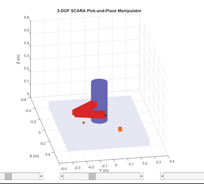

# Design and Simulation of a 3-DOF SCARA Robotic Manipulator

## Project Overview
This project presents the design, kinematic modeling, and simulation of a 3-DOF SCARA robotic manipulator using MATLAB.

The system demonstrates an autonomous industrial pick-and-place sequence through forward and inverse kinematics, trajectory interpolation, and motion control with real-time 3D visualization.

## Objectives
- Implement forward kinematics for end-effector position calculation.
- Develop inverse kinematics for joint angle computation.
- Perform trajectory interpolation between task-space points.
- Execute an autonomous pick-and-place sequence.
- Visualize the manipulator motion in MATLAB 3D environment.

## Features
- 3-DOF SCARA configuration.
- Kinematic modeling implementation.
- Forward & Inverse Kinematics implementation.
- Autonomous pick-and-place logic.
- Precise end-effector positioning.
- Real-time simulation rendering.
- Adjustable motion speed.

## System Workflow
1. Home Position Initialization  
2. Move to Pick Position  
3. Object Grasp (Attach Logic)  
4. Move to Place Position  
5. Object Release (Detach Logic)  
6. Return to Home Configuration

##  Outcome
The simulation successfully demonstrates accurate and reliable end-effector positioning from home configuration to final placement using kinematic modeling and autonomous state-based motion control.

## Simulation Preview

## Project Report
A detailed technical report covering modeling methodology, task planning, implementation phases, and results can be accessed below:
[View Full Project Report](3DOF_Manipulator_Report.pdf)

## Future Improvements
- Time-parameterized trajectory planning
- Polynomial trajectory generation
- Hardware integration with Arduino
- Closed-loop PID control implementation
- GUI-based interactive control

## Applications
- Industrial pick-and-place systems  
- Assembly automation  
- Educational robotics platforms  
- Manufacturing process simulation 

## Author
Nihira Hassan  
B.Tech CSE (AI & ML)
Developed as part of the Def-Space Winter Internship (BSERC).

